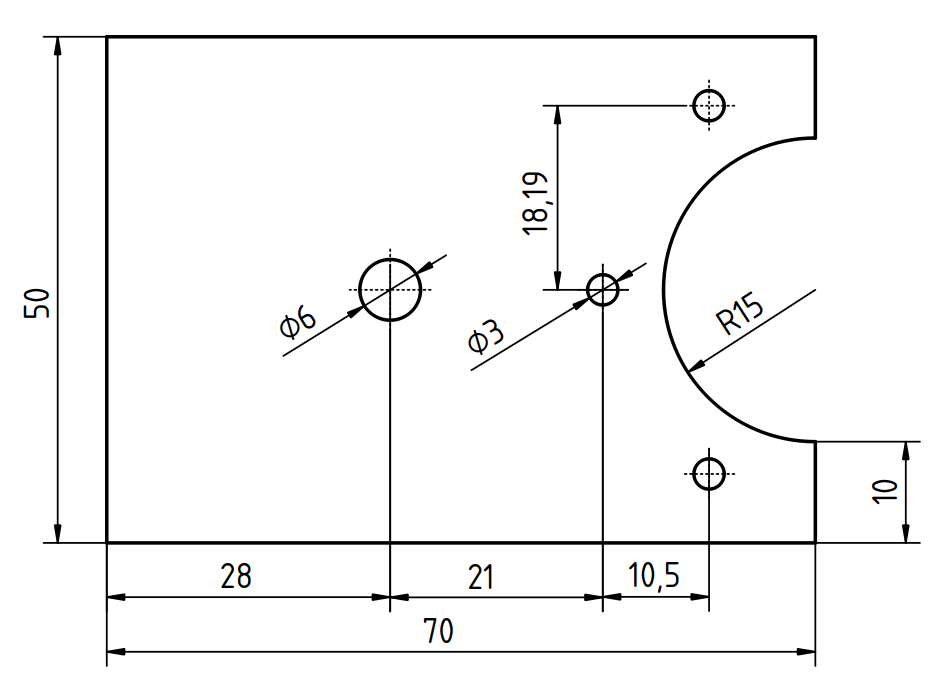

# Fabricación del arma

El arma de Pepperoni está compuesta por dos piezas iguales cortadas de una chapa de aluminio de 1.5 mm de espesor. Revisa el [plano acotado](https://github.com/kikeelectronico/pepperoni/blob/main/3d-model/Hoja%20del%20arma.pdf) en formato PDF.

