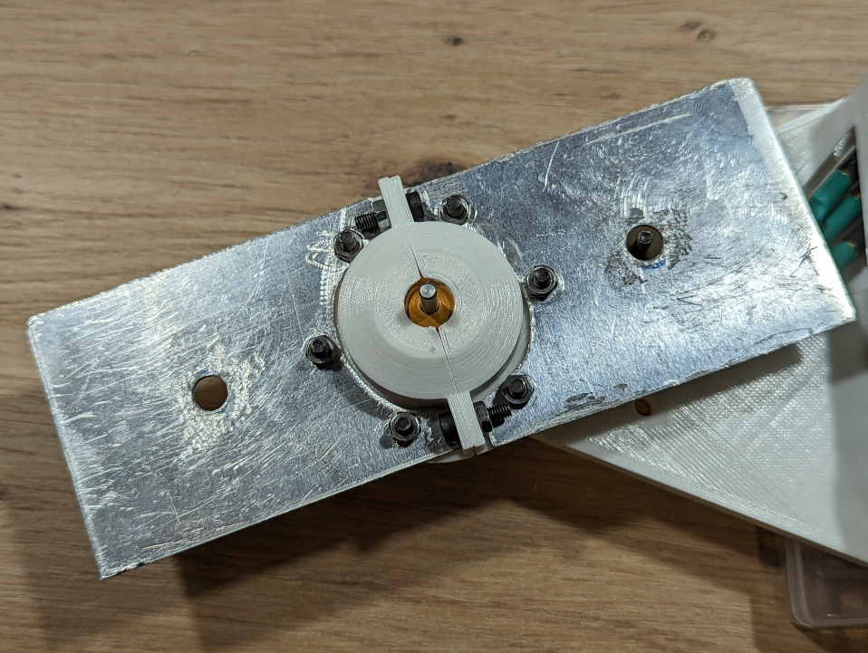

# Bloqueos de arma

Pepperoni cuenta con un arma cinética que de ser encendida por error puede causar daños personales y materiales. Por favor, ten mucho cuidado al manipular el robot y bloquea el arma, especialmente cuando la batería está conectada.

El robot cuenta con dos sistemas de bloqueo de arma que se alinean con uno de los aguejos del arma para atravesarla.

## Bloqueo por tornillo

Se puede introducir un tornillo M3x20 en el inserto roscado desde la parte inferior del robot.

Desde la parte superior se ve de la siguiente manera:

## Bloque por barra

Se puede introducir un objeto con forma de barra como un destornillador por el agujero de la tapa que no cuenta con inserto.

