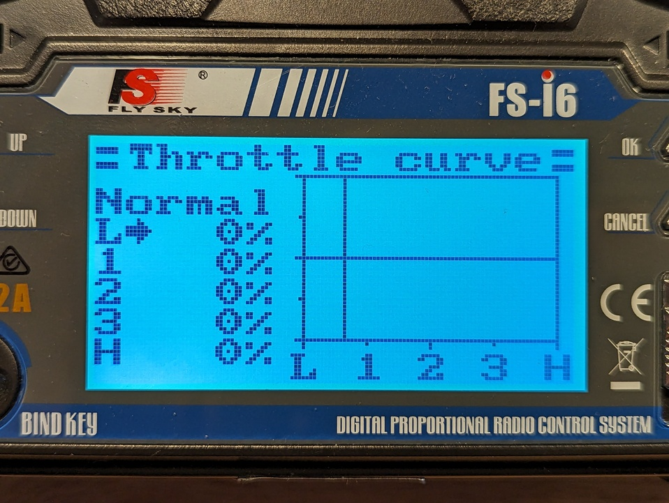
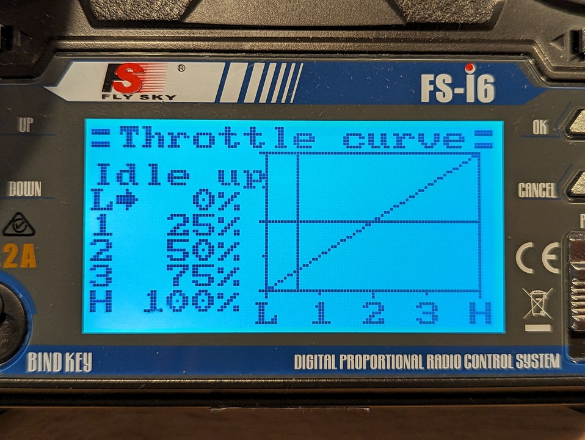

# Emisora

Para Pepperoni he elegido la emisora FlySky FS-i6. A continuación puedes ver la configuración adecuada para el bot.

## Traslación

Pepperoni se traslada usando un sistema diferencial de dos ruedas: el motor izquierdo mueve la rueda izquierda y el motor derecho mueve la rueda derecha.

En la emisora, ambos motores se controlan con un solo _joystick_, el derecho. Mover el _joystick_ hacia arriba hace que el bot avance, hacia abajo que retroceda, hacia la derecha que gire sobre sí mismo en sentido horario y hacia la izquierda que gire sobre sí mismo en sentido antihorario.

Para conseguir este modo de acción es necesario que configures lo siguiente:

### Elevon

La configuración _elevon_ permite mezclar los canales del _joystick_ derecho para controlar ambos motores con él. Configura _elevon_ de la siguiente manera:

### Reverse

Si los motores no giran en el sentido esperado, experimenta con esta configuración o prueba a invertir la posición de los cables de los motores. En mi caso tuve que invertir los canales 1 y 2. 

:::danger Peligro

No inviertas el canal 3. Si lo haces, el arma puede comenzar a girar inmediatamente a máxima velocidad estando el _joystick_ en la posición de reposo.

:::

## Arma

El arma se controla usando el _joystick_ izquierdo. Cuanto más arriba, más rápido gira.

Por seguridad, he usado el interruptor _SWB_ para bloquear la activación del arma. Si el interruptor se encuentra en la posición _1_ el arna no obedece al comando del _joystick_ derecho. Por lo que antes de iniciar el giro del arma hay que cambiar el interruptor a la posición _2_.

Para conseguir este bloqueo por interruptor tienes que configurar lo siguiente:

### Switches assign

La configuración de _swiches_ permite asignar funcionalidades a los interruptores. En este caso, el único relevante es _SWB_.

### Throttle curve

La configuración de _throttle curve_ permite que el motor del arma responda con curvas distintas en función de la posición del interruptor _SWB_.

#### Posición Normal

#### Posición Idle up

