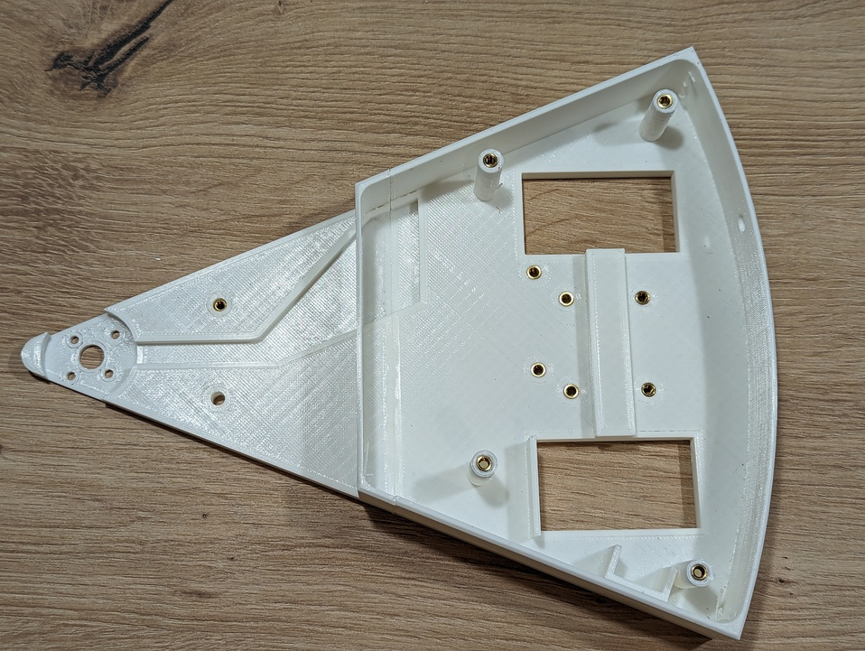
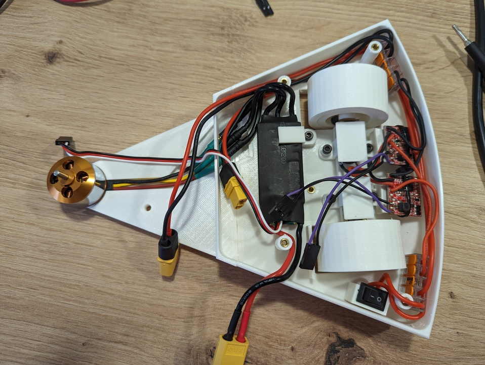

# Ensamblaje

Esta guía describe el proceso de ensamblaje de Pepperoni.

:::caution Atención

Esta guia no está finalizada y muchas imágenes no están actualziadas.

:::

## Antes de comenzar

Revisa que dispones de todos los materiales descritos en el [BOM](http://localhost:3000/docs/bom) y de todas las [piezas](http://localhost:3000/docs/printing) impresas en 3d. Si usas materiales alternativos puede que necesites improvisar, pero improvisar mola.

## Paso a paso

### 1. Base del chasis

#### Materiales necesarios

- Pieza impresa `base`.
- 10 x Inserto metálico para plástico M3.

#### Proceso

Para cada inserto:

1. Coloca de forma superficial el inserto sobre el agujero.
2. Usa un soldador caliente para empujar el inserto dentro del agujero.

:::caution Atención

No hagas mucha fuerza con el soldador. Los insertos se introducen muy rápidamente una vez alcanzan la temperatura óptima.

:::

### 2. Motor del spinner

#### Materiales necesarios

- Subensamblaje del paso anterior.
- Motor brushless.
- 4 x Tornillo M3x4.

#### Proceso

1. Coloca el motor en su espacio del chasis como se muestra en la siguiente imagen. Presta atención a la alineación de los cables, estos deben guiarse por su correspondiente canal.
2. Dala vuelta al chasis. Sujeta el motor con una mano para que no se mueva.
3. Coloca los tornillos para anclar el motor al chasis.

### 3. ESC del motor del spinner

#### Materiales necesarios

- Subensamblaje del paso anterior.
- ESC para motor brushless.
- Pieza impresa `pinza ESC`.
- 1 x tornillo M3x16.

#### Proceso

1. Pasa los cables del motor brushless por la apertura del chasis.
2. Conecta los tres cables del motor brushless al ESC.
3. Coloca el ESC como se aprecia en la imagen.
4. Fija el ESC al chasis usando la pieza impresa `pinza ESC` y el tornillo M3x16.

### 4. ESC y motores DC.

#### Materiales necesarios

- 2 x Motor DC.
- 2 x ESC para motor DC.

#### Proceso

Para cada motor:

1. Conecta mediante cables y soldadura el motor DC con el ESC de corriente continua.

:::tip

Corta los cables que unen los motores con los ESC de corriente continua con una longitud de 50 mm.

:::

### 5. Ruedas.

#### Materiales necesarios

- Subensamblaje del paso anterior.
- 2 x Pieza impresa `llanta`.
- 2 x Pieza impresa `neumático`.
- 2 x Inserto metálico para plástico M3.
- 2 x Tornillo M3x16.  

#### Proceso

Repite el proceso para cada rueda:

1. Coloca el inserto sobre el agujero perpendicular al eje de rotación de la rueda.
2. Usa un soldador caliente para empujar el inserto dentro del agujero.
3. Coloca el tornillo en el inserto girandolo muy pocas vueltas.
4. Introduce el eje del motor DC por el agujero central de la llanta. Ten encuenta que la cara plana del eje del motor debe estar alineada con el tornillo de la llanta.
5. Apreta el tornillo hasta fijar la llanta a al eje del motor.
6. Coloca el neumático alrededor de la llanta.

### 6. Motores en el chasis.

#### Materiales necesarios

- Subensamblaje del paso 3.
- Subensamblaje del paso 5.
- 2 x Pieza impresa `grapa motor DC`.
- 2 x Pieza impresa `soporte ESC DC`.
- 2 x Pieza impresa `separador 2mm`.
- 4 x tornillo M3x16.
- 2 x bridas.

#### Proceso

Para cada motor:

1. Coloca el motor en el interior de la pieza `grapa motor DC`.

:::caution Atención

Observa que la pieza impresa cuenta con un protuberancia que encaja en la reductora del motor.

:::

2. Coloca el subensamblaje del paso anterior en el chasis.
3. Inserta el separador de 2 mm impreso en un tornillo y atornillalo en el agujero más cercano a la punta del robot.
4. Coloca la pieza `soporte ESC` alineando su agujero con el agujero más alejado de la punta del robot.
5. Atornilla ambas piezas al chásis en el agujero más alejado de la punta del robot.
6. Fija el ESC a la pieza `soporte ESC DC` usando una brida.

### 7. Arnes de cableado.

#### Materiales necesarios

- Subensamblaje del paso anterior.
- 1 x Conector XT60 macho.
- 1 x Conector XT60 hembra.
- 2 x Conector Wago 5 vias.
- Cable 1 mm² rojo y negro.
- Interruptor.

#### Proceso

1. Monta el siguiente arnes de cableado.

ToDo: Esquema del arnés

2. Coloca el arnés en el robot de la siguiente forma:

3. Conecta los cables de alimentación de los ESC de DC a los conectores Wago.
4. Conecta el conector XT60 del ESC del motor brushless al correspondiente conector del arnés.

### 8. Receptor.

#### Materiales necesarios

- Subensamblaje del paso anterior.
- Receptor RF. 

#### Proceso

:::caution Atención

Presta especial atención a la orientación de los conectores.

:::

1. Conecta el ESC del motor DC derecho en el canal 1 del receptor.
1. Conecta el ESC del motor DC izquierdo en el canal 2 del receptor.
2. Conecta el ESC del motor brushless en el canal 3 del receptor.
3. Coloca el receptor RF en la parte izquierda del robot tal y como se observa en la imagen.

### 9. Grapa arma.

#### Materiales necesarios

- Subensamblaje del paso anterior.
- 2 x Pieza impresa `grapa arma`.
- 2 x Tornillos M3x16.
- 2 x Tuerca M3. 
- Cinta de doble cara.

#### Proceso

1. Pega un fragmento de cinta de doble cara en el interior de cada pieza `grapa arma`.
2. Coloca cada pieza `grapa arma` sobre el motor brushless asegurando que los pines ciruclares que se encuentran en el interior de la pieza quedan alineados con los agujeros del motor.
3. Fija ambas piezas impresas entre sí mediante los tornillos y las tuercas.

