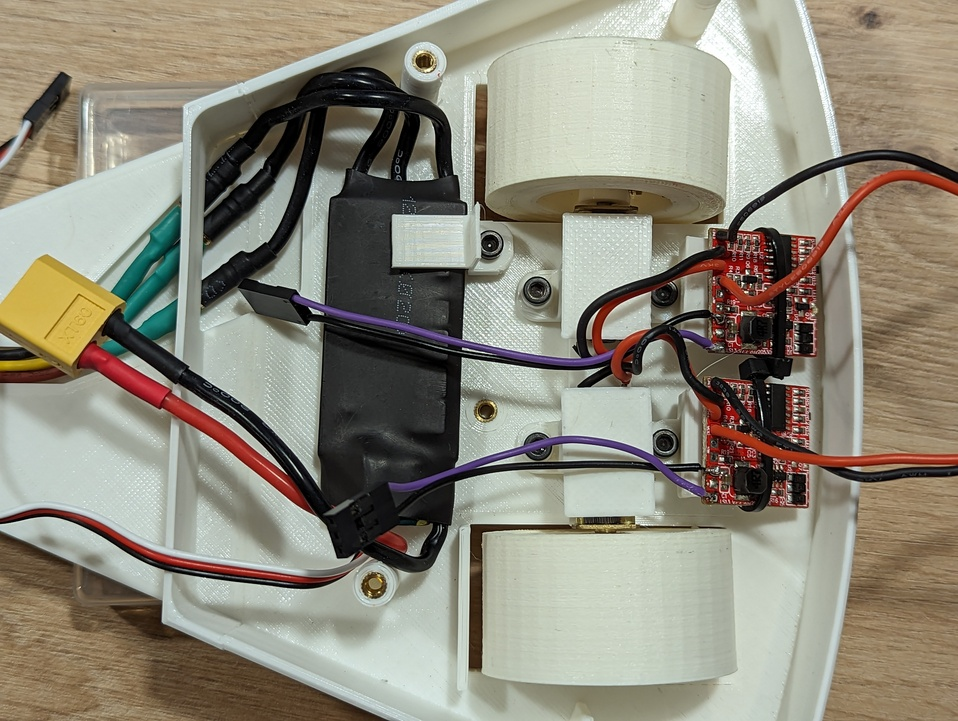
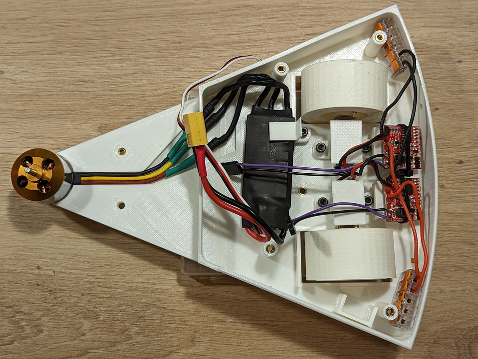

import Tabs from '@theme/Tabs';
import TabItem from '@theme/TabItem';

# Ensamblaje

Esta guía describe el proceso de ensamblaje de Pepperoni.

## Antes de comenzar

Revisa que dispones de todos los materiales descritos en el [BOM](https://pepperoni.enriquegomez.me/docs/bom), de todas las piezas [impresas en 3D](https://pepperoni.enriquegomez.me/docs/printing) y de las piezas que conforman el [arma](https://pepperoni.enriquegomez.me/docs/arma/). Si usas materiales alternativos puede que necesites improvisar, pero improvisar mola.

## Paso a paso

### 1. Base del chasis

#### Materiales necesarios

- 1 x Pieza impresa `base`.
- 11 x Inserto metálico para plástico M3.

#### Proceso

Introduce los insertos en sus respectivos agujeros. Fijate en la imagen para localizar su posición. 

Para cada inserto:

1. Coloca de forma superficial el inserto sobre el agujero.
2. Usa un soldador caliente para empujar el inserto dentro del agujero.

:::tip

No hagas mucha fuerza con el soldador. Los insertos se introducen muy rápidamente una vez alcanzan la temperatura óptima.

:::

### 2. Motor del spinner

#### Materiales necesarios

- Subensamblaje del paso anterior.
- 1 x Motor brushless.
- 4 x Tornillo M3x4.

#### Proceso

<Tabs>
  <TabItem value="step_2_1" label="Paso 2.1" default>
    Coloca el motor en su espacio del chasis como se muestra en la siguiente imagen. Presta atención a la alineación de los cables, estos deben guiarse por su correspondiente canal.
      
    
  </TabItem>
  <TabItem value="step_2_2" label="Paso 2.2">
     Dala vuelta al chasis y coloca los tornillas para anclar el motor al chásis.
      
    
  </TabItem>
</Tabs>

### 3. ESC del motor del spinner

#### Materiales necesarios

- Subensamblaje del paso anterior.
- 1 x Pieza impresa `pinza ESC`.
- 1 x ESC para motor brushless.
- 1 x tornillo M3x16.

#### Proceso

<Tabs>
  <TabItem value="step_3_1" label="Paso 3.1" default>
    Pasa los cables del motor brushless por la apertura del chasis y conecta los tres cables del motor brushless al ESC.
      
    
  </TabItem>
  <TabItem value="step_3_2" label="Paso 3.2">
     Fija el ESC al chasis usando la pieza impresa <i>pinza ESC</i> y el tornillo M3x16.
      
    
  </TabItem>
</Tabs>

### 4. ESC y motores DC

#### Materiales necesarios

- 2 x Motor DC.
- 2 x ESC para motor DC.

#### Proceso

Para cada motor:

1. Conecta mediante cables y soldadura el motor DC con el ESC de corriente continua.
2. Quita el cable central de alimentación del conector de tres pines que irá conectado al receptor.

:::tip

Corta los cables con las siguientes longitudes.
- Motor DC: 50 mm.
- Conector tres pines: 60 mm.
- Cables de alimentación: 60 mm.

:::

### 5. Ruedas

#### Materiales necesarios

- Subensamblaje del paso anterior.
- 2 x Pieza impresa `llanta`.
- 2 x Pieza impresa `neumático`.
- 2 x Inserto metálico para plástico M3.
- 2 x Tornillo M3x16.  

#### Proceso

Repite el proceso para cada rueda:

<Tabs>
  <TabItem value="step_5_1" label="Paso 5.1" default>
    Coloca el inserto sobre el agujero perpendicular al eje de rotación de la rueda y atornilla el tornillo girandolo muy pocas vueltas.
      
    
  </TabItem>
  <TabItem value="step_5_2" label="Paso 5.2">
    Introduce el eje del motor DC por el agujero central de la llanta y apreta el tornillo hasta fijarlos. Ten en cuenta que la cara plana del eje del motor debe estar alineada con el tornillo de la llanta.
      
    
  </TabItem>
  <TabItem value="step_5_3" label="Paso 5.3">
    Coloca el neumático alrededor de la llanta.
      
    
  </TabItem>
</Tabs>

### 6. Motores en el chasis

#### Materiales necesarios

- Subensamblaje del paso 3.
- Subensamblaje del paso 5.
- 2 x Pieza impresa `grapa motor DC`.
- 2 x Pieza impresa `soporte ESC DC`.
- 2 x Pieza impresa `separador 2mm`.
- 4 x tornillo M3x16.
- 2 x bridas.
- 2 x Conector Wago 5 vias.

#### Proceso

Para cada motor:

<Tabs>
  <TabItem value="step_6_1" label="Paso 6.1" default>
    Coloca el motor en el interior de la pieza <i>grapa motor DC</i>.
      
    
  </TabItem>
  <TabItem value="step_6_2" label="Paso 6.2">
    Coloca el subensamblaje del paso 6.1 en el chasis.
      
    
  </TabItem>
  <TabItem value="step_6_3" label="Paso 6.3">
    Inserta la pieza <i>separador 2 mm</i> en un tornillo.
      
    
  </TabItem>
  <TabItem value="step_6_4" label="Paso 6.4">
    Atornilla el tornillo del paso 6.3 en el agujero más cercano a la punta del robot.
      
    
  </TabItem>
  <TabItem value="step_6_5" label="Paso 6.5">
    Coloca la pieza <i>soporte ESC</i> alineando su agujero con el agujero más alejado de la punta del robot.
      
    
  </TabItem>
  <TabItem value="step_6_6" label="Paso 6.6">
    Atornilla ambas piezas al chásis.
      
    
  </TabItem>
  <TabItem value="step_6_7" label="Paso 6.7">
    Fija el ESC a la pieza <i>soporte ESC DC</i> usando una brida y corta el exceso de esta.
      
    
  </TabItem>
</Tabs>

:::caution Atención

Observa que la pieza impresa _grapa motor DC_ cuenta con un protuberancia que encaja en la reductora del motor.

:::

El resultado tras colocar ambos motores debe ser el siguiente:

Completa el montaje de los motores en el chasis colocando los dos conectores Wago, uno a cada lado del robot. Observa como el conector de masa se encuentra en el lado derecho del robot (parte superior de la foto).

### 7. Arnes de cableado

#### Materiales necesarios

- Subensamblaje del paso anterior.
- 1 x Conector XT60 macho.
- 1 x Conector XT60 hembra.
- 1 x Interruptor.
- Cable 1 mm² rojo y negro.

#### Proceso

<Tabs>
  <TabItem value="step_7_1" label="Paso 7.1" default>
    Prepara un cable como el de la foto usando el conector CT60 hembra, 32 cm de cable rojo y 18 cm de cable negro.
      
    
  </TabItem>
  <TabItem value="step_7_2" label="Paso 7.2">
    Conecta el conector XT60 del cable del paso 7.1 al ESC del motor brushless y los otros extremos a los correspondiente conectores Wago.
      
    
  </TabItem>
  <TabItem value="step_7_3" label="Paso 7.3">
    Prepara un cable como el de la foto usando el conector XT60 macho, el interruptor, 42 cm de cable rojo, 6 cm de cable rojo y 25 cm de cable negro.
      
    
  </TabItem>
  <TabItem value="step_7_4" label="Paso 7.4">
    Coloca el cable del paso 7.3 como se muestra en la foto. Inserta el interruptor en su hueco, conecta los extremos libres a los conectores Wago correspondientes y deja libre el conector XT60 para la batería.
      
    
  </TabItem>
</Tabs>

:::note Un dato curioso

Si te fijas, el cable del paso 7.1 está dañado. Esto de debe a que estas fotos se hicieron tras el combate de la [OSHWDem](https://oshwdem.org/) 2023. Revisando los vídeos de los combates, creo que estos daños los causó [Abrelatas](https://github.com/JavierIH/abrelatas) en el combate _todos contra todos_.

:::

### 8. Receptor

#### Materiales necesarios

- Subensamblaje del paso anterior.
- 1 x Receptor RF. 

#### Proceso

:::caution Atención

Presta especial atención a la orientación de los conectores.

:::

1. Conecta el ESC del motor DC derecho en el canal 1 del receptor.
1. Conecta el ESC del motor DC izquierdo en el canal 2 del receptor.
2. Conecta el ESC del motor brushless en el canal 3 del receptor.
3. Coloca el receptor RF en la parte izquierda del robot tal y como se observa en la imagen.

### 9. Arma

#### Materiales necesarios

- Subensamblaje del paso anterior.
- 2 x Pieza impresa `grapa arma`.
- 2 x Hojas del arma.
- 8 x Tornillos M3x16.
- 8 x Tuerca M3. 
- Cinta de doble cara acolchada.

#### Proceso

<Tabs>
  <TabItem value="step_9_1" label="Paso 9.1" default>
    Coloca un fragmento de cinta de doble cara en el interior de cada pieza <i>grapa arma</i>
      
    
  </TabItem>
  <TabItem value="step_9_2" label="Paso 9.2">
    Encaja las piezas del paso 9.1 en el motor brushless. Ten encuenta que los pines de alineación de las piezas impresas encajan en los agujeros superiores del motor.
      
    
  </TabItem>
  <TabItem value="step_9_3" label="Paso 9.3">
    Fija ambas piezas con dos tornillos y dos tuercas.
      
    
  </TabItem>
  <TabItem value="step_9_4" label="Paso 9.4">
    Une las hojas del arma a las grapas del arma con tornillos y tuercas. Observa como los tornillos se introducen desde la parte inferior del arma.
      
    
  </TabItem>
</Tabs>

### 10. Batería

#### Materiales necesarios

- Subensamblaje del paso anterior.
- 1 x Pieza impresa `pinza batería`.
- 1 x Batería.
- 1 x Tornillo M3x16.

#### Proceso

:::danger Peligro

Asegurate de tener bloqueada el árma de forma mecánica antes de conectar la batería. Revisa el doc [Bloqueo de arma](https://pepperoni.enriquegomez.me/docs/bloqueos/).

:::
:::caution Atención

Coloca la batería solo cuando vayas a usar el robot.

:::

1. Conecta la batería al conector XT60 de alimentación.
2. Coloca la batería como se observa en la imagen inferior.
3. Coloca la pieza <i>pinza batería</i> y fíjala con el tornillo.

### 11. Tapa

#### Materiales necesarios

- Subensamblaje del paso anterior.
- 1 x Pieza impresa `tapa`.
- 4 x Tornillo M3x16.

#### Proceso

1. Coloca y alinéa la pieza <i>tapa</i>.
2. Coloca los cuatro tornillos para fijar la tapa.

